# CMS User Manual (With Screenshots)

## Table of Contents

1. [Introduction](#introduction)
2. [Getting Started](#getting-started)
3. [User Roles and Permissions](#user-roles-and-permissions)
4. [Dashboard](#dashboard)
5. [Products Management](#products-management)
6. [Orders Management](#orders-management)
7. [Contacts Management](#contacts-management)
8. [Wholesale Applications](#wholesale-applications)
9. [Stock Management](#stock-management)
10. [FAQs Management](#faqs-management)
11. [Testimonials Management](#testimonials-management)
12. [Flash Info Management](#flash-info-management)
13. [Admin Users Management](#admin-users-management)
14. [Profile Management](#profile-management)
15. [Troubleshooting](#troubleshooting)

---

## Introduction

The Olivia Content Management System (CMS) is a comprehensive platform for managing your e-commerce website. It enables you manage products, orders, customer inquiries, wholesale applications, inventory, and website content all from one centralized location.

### Key Features

- **Product Management**: Create, edit, and manage product listings with images, pricing, and inventory
- **Order Processing**: Track and manage customer orders with status updates
- **Customer Communication**: Handle contact submissions and respond via email or WhatsApp
- **Wholesale Management**: Review and process wholesale/distributor applications
- **Inventory Control**: Track stock levels, receive alerts, and manage inventory movements
- **Content Management**: Manage FAQs, testimonials, and promotional flash information
- **User Management**: Control access with role-based permissions

---

## Getting Started

### Accessing the CMS

1. Navigate to your website's CMS login page: `/cms/login`

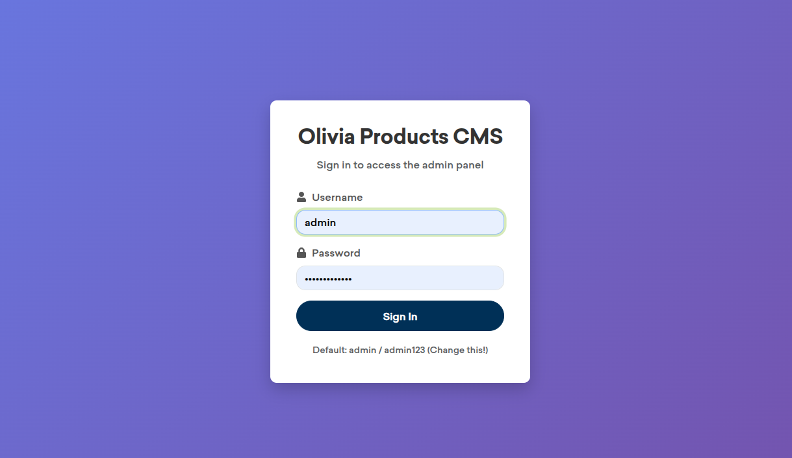
*Figure 1: CMS Login Page - Enter your username and password to access the system*

2. Enter your username and password
3. Click "Login" to access the dashboard

### Default Login Credentials

**⚠️ IMPORTANT**: Change the default password immediately after first login!

- **Username**: `admin`
- **Password**: `admin123`

### Navigation

Once logged in, you'll see a navigation menu on the left side with the following sections:

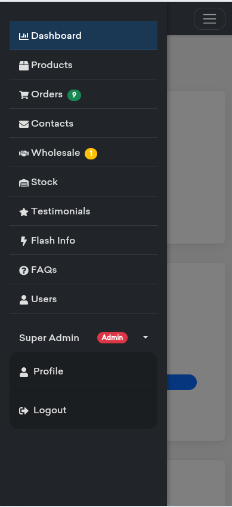
*Figure 2: CMS Navigation Menu - Access all sections from the top navbar (or sidebar on mobile)*

- **Dashboard** - Overview of key metrics
- **Products** - Manage product catalog
- **Orders** - View and process orders
- **Contacts** - Handle customer inquiries
- **Wholesale** - Review wholesale applications
- **Stock** - Inventory management
- **FAQs** - Manage frequently asked questions
- **Testimonials** - Manage customer testimonials
- **Flash Info** - Manage promotional popups
- **Admin Users** - User management (Admin only)
- **Profile** - Your account settings

---

## User Roles and Permissions

The CMS uses a role-based access control system with three roles:

### Admin
- **Full access** to all features
- Can manage users, products, orders, and all content
- Can delete records permanently
- Can access Admin Users section

### Sales
- Can manage products, orders, wholesale applications, and stock
- Can view and reply to contacts
- Cannot delete records permanently
- Cannot manage users or content (FAQs, testimonials, flash info)

### Support
- Can view dashboard and manage profile
- Can view and reply to contacts
- Can manage FAQs, testimonials, and flash info
- Cannot access products, orders, wholesale, or stock management

### Permission Summary

| Feature | Admin | Sales | Support |
|---------|-------|-------|---------|
| Dashboard | ✅ | ✅ | ✅ |
| Products | ✅ | ✅ | ❌ |
| Orders | ✅ | ✅ | ❌ |
| Contacts | ✅ | ✅ | ✅ |
| Wholesale | ✅ | ✅ | ❌ |
| Stock | ✅ | ✅ | ❌ |
| FAQs | ✅ | ❌ | ✅ |
| Testimonials | ✅ | ❌ | ✅ |
| Flash Info | ✅ | ❌ | ✅ |
| Admin Users | ✅ | ❌ | ❌ |
| Profile | ✅ | ✅ | ✅ |

---

## Dashboard

The dashboard provides an overview of your business metrics and quick access to common tasks.

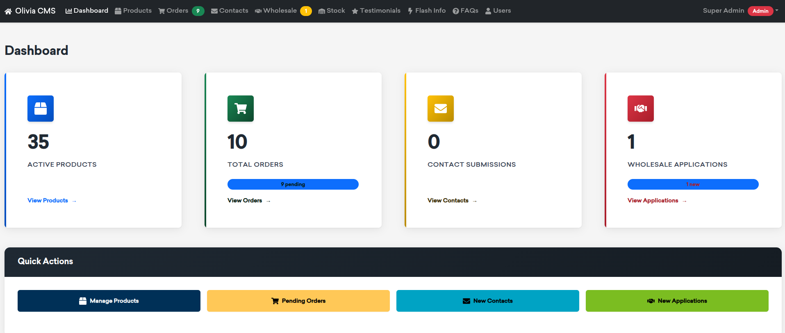
*Figure 3: CMS Dashboard - Overview of key metrics and quick actions*

### Dashboard Features

1. **Statistics Cards**
   - Total products
   - Total orders
   - Pending orders
   - New contacts
   - New wholesale applications

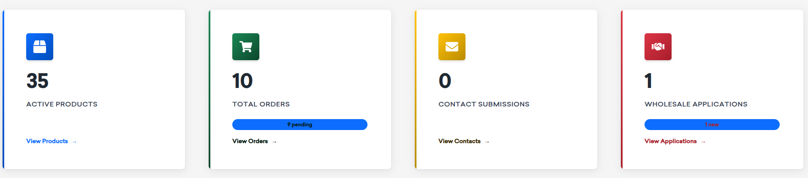
*Figure 4: Statistics Cards - Key business metrics at a glance*

2. **Quick Actions**
   - Direct links to manage products
   - View pending orders
   - Check new contacts
   - Review new wholesale applications

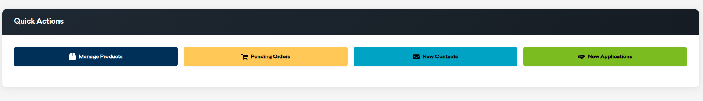
*Figure 5: Quick Actions - Fast access to common tasks*

3. **Recent Activity**
   - Latest orders
   - Recent contacts
   - System notifications

---

## Products Management

The Products section allows you to manage your entire product catalog.

### Viewing Products

1. Navigate to **Products** from the main menu

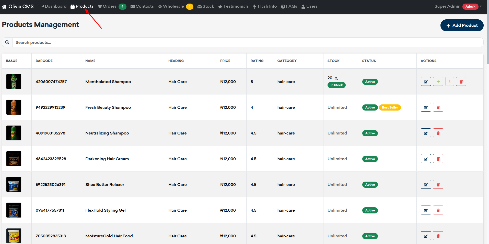
*Figure 6: Products List - View all products in a table format*

2. Use the search bar to find specific products by name, heading, or barcode
3. View products in a table format with key information:
   - Product image
   - Barcode
   - Name and heading
   - Price
   - Rating
   - Categories
   - Stock status
   - Active/Inactive status

### Adding a New Product

1. Click the **"Add Product"** button

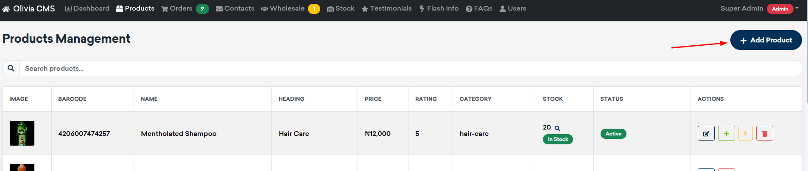
*Figure 7: Add Product Button - Click to create a new product*

2. Fill in the required fields in the product form:

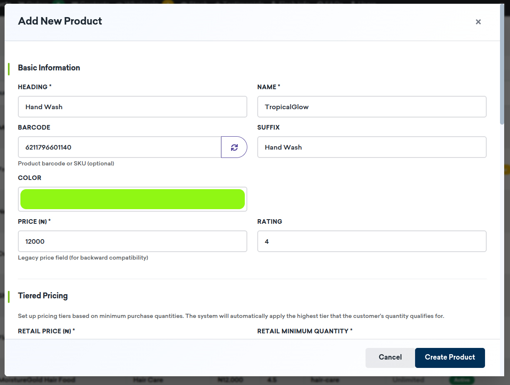
*Figure 8: Product Form - Basic Information Section*

#### Basic Information
- **Heading*** (e.g., "Hand Wash")
- **Name*** (e.g., "TropiGlow")
- **Barcode** (optional - can auto-generate)
- **Suffix** (optional, e.g., "Hand Wash")
- **Color** (for product display)
- **Price*** (in ₦)
- **Rating** (0-5)

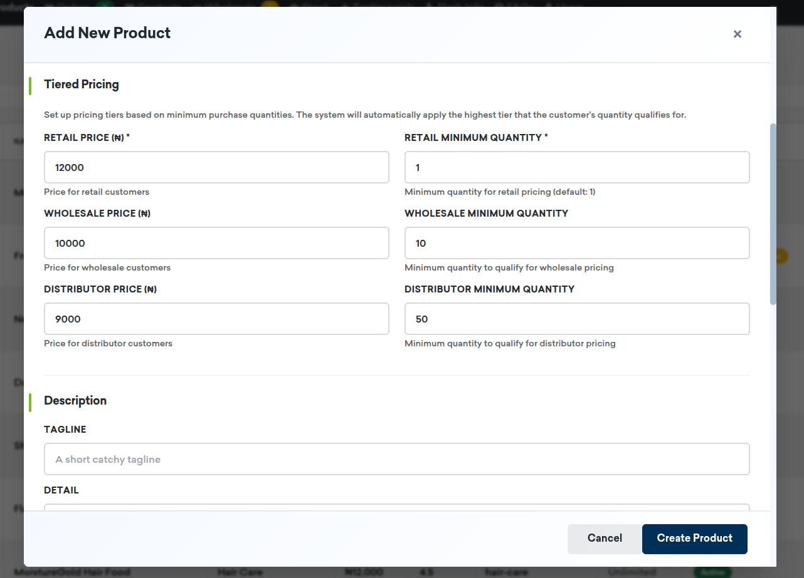
*Figure 9: Product Form - Tiered Pricing Section*

#### Tiered Pricing
Set up different pricing tiers based on quantity:
- **Retail Price*** and **Retail Minimum Quantity** (default: 1)
- **Wholesale Price** and **Wholesale Minimum Quantity** (optional)
- **Distributor Price** and **Distributor Minimum Quantity** (optional)

The system automatically applies the highest tier that the customer's quantity qualifies for.

*Figure 10: Product Form - Description Section*

#### Description
- **Tagline** (short catchy phrase)
- **Detail** (short description)
- **More Detail** (extended description)

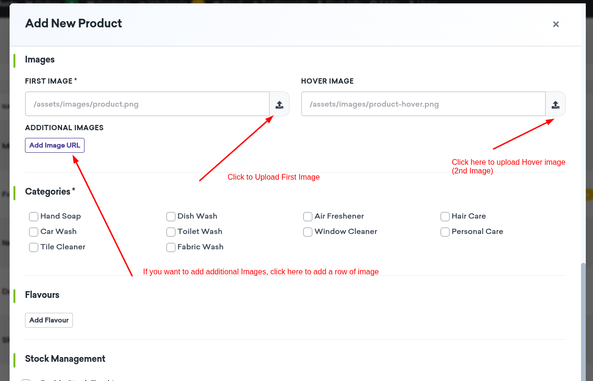
*Figure 11: Product Form - Images Section with Upload Functionality*

#### Images
- **First Image*** (main product image - required)
- **Hover Image** (shown on hover)
- **Additional Images** (multiple images supported)

You can:
- Enter image URLs directly
- Upload images using the upload button (max 2MB per image)
- Supported formats: JPEG, PNG, GIF, WebP, AVIF

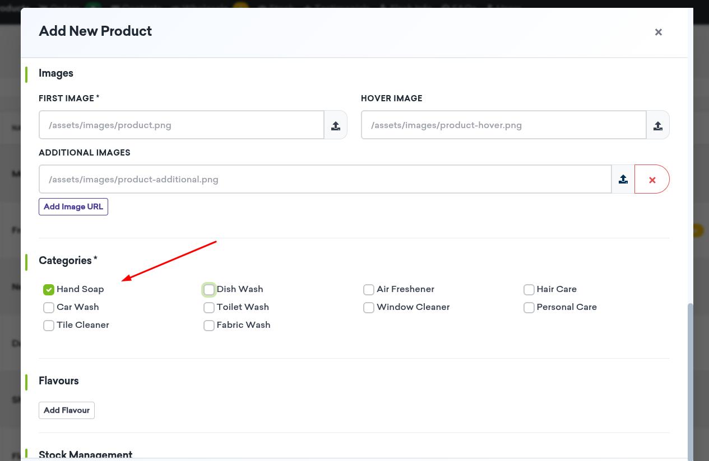
*Figure 12: Product Form - Categories Selection*

#### Categories
Select one or more categories:
- Hand Soap
- Dish Wash
- Air Freshener
- Hair Care
- Car Wash
- Toilet Wash
- Window Cleaner
- Personal Care
- Tile Cleaner
- Fabric Wash

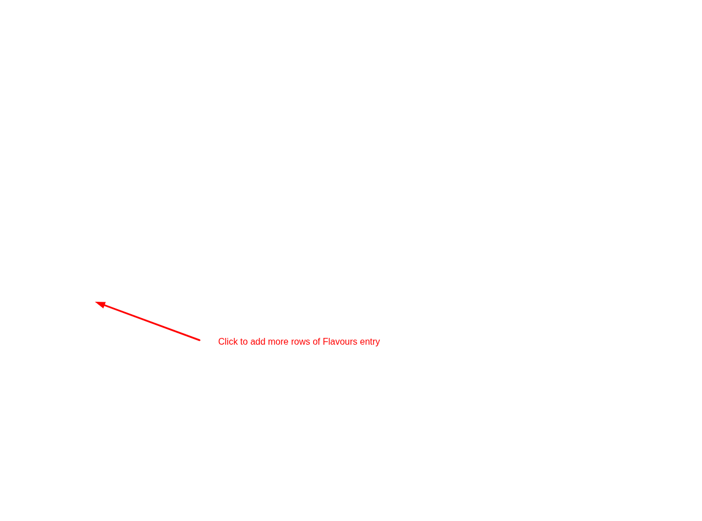
*Figure 13: Product Form - Flavours/Variants Section*

#### Flavours
Add product flavours/variants:
1. Click "Add Flavour"
2. Enter flavour name (e.g., "🍌 Banana")
3. Add multiple flavours as needed

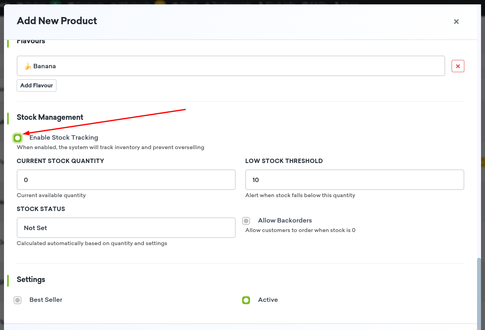
*Figure 14: Product Form - Stock Management Section*

#### Stock Management
- **Enable Stock Tracking**: Toggle to enable inventory tracking
- **Current Stock Quantity**: Current available units
- **Low Stock Threshold**: Alert when stock falls below this number (default: 10)
- **Allow Backorders**: Allow customers to order when stock is 0
- **Stock Status**: Automatically calculated (In Stock, Low Stock, Out of Stock, On Backorder)

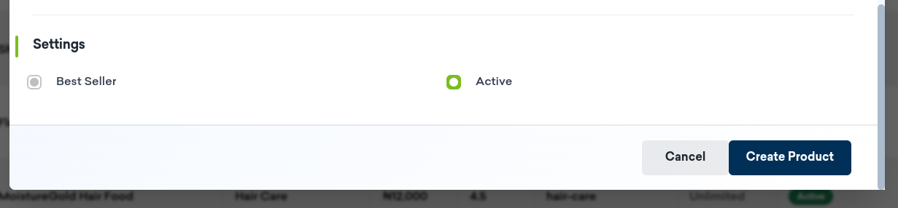
*Figure 15: Product Form - Settings Section*

#### Settings
- **Best Seller**: Mark as best-selling product
- **Active**: Toggle to show/hide product on website

3. Click **"Create Product"** to save

### Editing a Product

1. Click the **Edit** button (pencil icon) next to the product

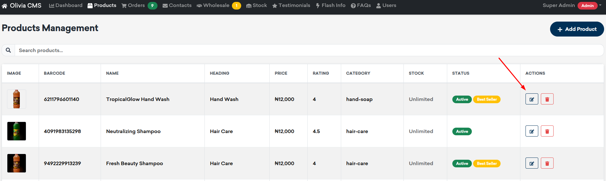
*Figure 16: Edit Product Button - Click to modify product details*

2. Modify any fields as needed
3. Click **"Update Product"** to save changes

### Stock Adjustments

For products with stock tracking enabled:

*Figure 17: Stock Adjustment Buttons - Add stock or adjust inventory*

1. Click the **"+"** button to add stock (purchase)
2. Click the **"±"** button to manually adjust stock

*Figure 18: Stock Adjustment Modal - Enter quantity and movement type*

3. Enter quantity and notes
4. Select movement type:
   - **Purchase**: Adding stock from supplier
   - **Adjustment**: Manual correction
   - **Return**: Stock being returned
   - **Damaged**: Removing damaged items

### Viewing Stock History

1. Click the **search icon** next to stock quantity

*Figure 19: Stock History Icon - Click to view movement history*

2. View complete history of stock movements

*Figure 20: Stock History Modal - Complete inventory movement history*

3. See who made changes and when

### Deleting a Product

1. Click the **Delete** button (trash icon)

*Figure 21: Delete Product Button - Click to delete product*

2. Choose deletion method:

*Figure 22: Delete Product Modal - Choose deactivate or permanent delete*

   - **Deactivate**: Hide from website, keep in database (reversible)
   - **Force Delete**: Permanently remove from database (irreversible)

---

## Orders Management

The Orders section helps you track and process customer orders.

### Viewing Orders

1. Navigate to **Orders** from the main menu

*Figure 23: Orders List - View all orders with filters*

2. Use filters to view specific orders:
   - **All**: All orders
   - **Pending**: Orders awaiting processing
   - **Processing**: Orders being prepared
   - **Shipped**: Orders that have been shipped
   - **Delivered**: Completed orders
   - **Cancelled**: Cancelled orders
   - **Paid/Not Paid**: Filter by payment status

*Figure 24: Order Filters - Filter by status and payment*

3. Search by Order ID using the search bar

### Order Information

Each order displays:
- **Order ID**: Unique order identifier
- **Customer Name**: Customer's full name
- **Email**: Customer's email address
- **Total Amount**: Order total in ₦
- **Status**: Current order status
- **Date**: Order creation date
- **Payment Status**: Whether order is paid

### Updating Order Status

1. Use the dropdown menu in the Actions column

*Figure 25: Order Status Dropdown - Change order status*

2. Select new status:
   - **Pending**: Initial order state
   - **Processing**: Order is being prepared
   - **Shipped**: Order has been dispatched
   - **Delivered**: Order completed
   - **Cancelled**: Order cancelled

3. Status updates automatically

### Marking Orders as Paid

1. Check the **"Paid"** checkbox next to the order

*Figure 26: Order Paid Checkbox - Mark orders as paid*

2. Payment status updates immediately
3. Uncheck to mark as unpaid

### Viewing Order Details

1. Click the **eye icon** next to an order

*Figure 27: View Order Details Button - Click to see full order information*

2. View complete order information:

*Figure 28: Order Details Modal - Complete order information with items*

   - Customer details
   - Order items with images
   - Pricing tier information (if applicable)
   - Quantities and prices
   - Total amount

### Order Items

Order details show:
- Product images
- Product names
- Pricing tier (Retail, Wholesale, or Distributor)
- Quantity and unit price
- Line totals

---

## Contacts Management

The Contacts section manages customer inquiries and messages.

### Viewing Contacts

1. Navigate to **Contacts** from the main menu

*Figure 29: Contacts List - View all customer inquiries*

2. Filter by status:
   - **All**: All contact submissions
   - **New**: Unread messages
   - **Read**: Messages that have been read
   - **Replied**: Messages that have been responded to

*Figure 30: Contact Filters - Filter by status*

### Contact Information

Each contact shows:
- **ID**: Contact submission ID
- **Name**: Customer's full name
- **Email**: Customer's email (if provided)
- **Phone**: Customer's phone number
- **Message**: Customer's message (truncated in list view)
- **Status**: Current status
- **Date**: Submission date

### Updating Contact Status

1. Use the status dropdown in the Actions column

*Figure 31: Contact Status Dropdown - Update contact status*

2. Select new status:
   - **New**: Initial submission
   - **Read**: Message has been reviewed
   - **Replied**: Response has been sent
   - **Archived**: Archived for reference

### Viewing Contact Details

1. Click the **eye icon** next to a contact

*Figure 32: View Contact Details Button - Click to see full contact information*

2. View complete information:

*Figure 33: Contact Details Modal - Full contact information and message*

   - Full contact details
   - Complete message
   - Reply history (if any)

### Replying to Contacts

1. Open contact details
2. Click **"Reply"** button

*Figure 34: Reply Button - Click to send a reply*

3. Choose reply method:

*Figure 35: Reply Modal - Choose email or WhatsApp reply method*

   - **Email**: Send email response (requires customer email)
   - **WhatsApp**: Open WhatsApp with pre-filled message

4. Enter your reply message
5. Click **"Send Reply"**

**Note**: Email replies are sent automatically. WhatsApp replies open WhatsApp in a new window for you to send manually.

### Viewing Reply History

1. Open contact details
2. Click the **"Replies"** tab

*Figure 36: Reply History Tab - View all previous replies*

3. View all previous replies:

*Figure 37: Reply History - Complete history of all replies sent*

   - Reply method (Email/WhatsApp)
   - Message content
   - Sent date and time
   - Status (sent/failed/pending)
   - Sent by (admin name)

### Deleting Contacts

1. Click the **Delete** button (trash icon)
2. Confirm deletion
3. Contact is permanently removed

---

## Wholesale Applications

The Wholesale section manages applications from businesses interested in wholesale, distribution, or retail partnerships.

### Viewing Applications

1. Navigate to **Wholesale** from the main menu

*Figure 38: Wholesale Applications List - View all applications*

2. Filter by status:
   - **All**: All applications
   - **New**: New submissions
   - **Reviewing**: Under review
   - **Approved**: Approved applications
   - **Rejected**: Rejected applications

*Figure 39: Wholesale Filters - Filter applications by status*

### Application Information

Each application shows:
- **ID**: Application ID
- **Type**: Wholesale, Distribution, or Retail
- **Name**: Applicant's name
- **Business Name**: Company name
- **Email**: Contact email
- **Location**: City and state
- **Status**: Current status
- **Date**: Submission date

### Viewing Application Details

1. Click the **eye icon** next to an application

*Figure 40: View Wholesale Details Button - Click to see full application*

2. View complete information:

*Figure 41: Wholesale Details Modal - Complete application information*

#### Contact Information
- Full name
- Email (clickable mailto link)
- Phone (with WhatsApp and Call buttons)

*Figure 42: Contact Actions - WhatsApp and Call buttons*

#### Business Information
- Business name
- CAC Registration Number (with verification button)
- Website (if provided)
- Company logo (if uploaded)
- Physical address
- City, State, Country

*Figure 43: CAC Verification Button - Verify registration number*

#### Business Details
- Business types/categories
- About business description

#### Application Details
- Submission date and time
- Current status

### Verifying CAC Registration

1. Open application details
2. Click **"Verify"** next to CAC Registration Number
3. System verifies against CAC registry
4. View verification results:

*Figure 44: CAC Verification Result - Verified - Shows company details from CAC*

   - **Verified**: Shows company details from CAC
   - **Not Verified**: Registration number not found

*Figure 45: CAC Verification Result - Not Verified - Registration number not found*

### Updating Application Status

1. Use the status dropdown in the Actions column

*Figure 46: Wholesale Status Dropdown - Update application status*

2. Select new status:
   - **New**: Initial submission
   - **Reviewing**: Under review
   - **Approved**: Application approved
   - **Rejected**: Application rejected
   - **Archived**: Archived for reference

### Contacting Applicants

From application details:
- **Email**: Click email address to send email
- **WhatsApp**: Click WhatsApp button to open chat
- **Call**: Click Call button to make phone call

### Deleting Applications

1. Click the **Delete** button (trash icon)
2. Confirm deletion
3. Application is permanently removed

---

## Stock Management

The Stock section provides comprehensive inventory management and reporting.

### Stock Dashboard

The stock dashboard shows:

*Figure 47: Stock Dashboard - Overview of inventory metrics*

- **Products with Stock Tracking**: Total products with inventory enabled
- **Low Stock**: Products below threshold
- **Out of Stock**: Products with zero inventory
- **Active Alerts**: Current stock alerts

### Stock Alerts

View and manage stock alerts:
1. Navigate to **Stock** → **Alerts** tab

*Figure 48: Stock Alerts Tab - View and manage stock alerts*

2. Filter by alert type:
   - **All Alert Types**
   - **Low Stock**
   - **Out of Stock**
   - **Backorder**

3. View alert details:

*Figure 49: Stock Alerts List - All active stock alerts*

   - Product name
   - Alert type
   - Current stock quantity
   - Alert creation date

4. **Resolve Alert**: Click "Resolve" to mark alert as handled

*Figure 50: Resolve Alert Modal - Add resolution notes*

   - Add resolution notes (optional)
   - Alert is marked as resolved

### Stock Movements

Track all inventory changes:
1. Navigate to **Stock** → **Movements** tab

*Figure 51: Stock Movements Tab - View inventory movement history*

2. View movement history with filters:

*Figure 52: Stock Movements Filters - Filter by date range and type*

   - **Start Date** / **End Date**: Filter by date range
   - **Movement Type**: Filter by type (Purchase, Sale, Adjustment, Return, Damaged, Transfer)
   - **Limit**: Number of records per page

3. Movement details show:

*Figure 53: Stock Movements List - Complete movement history*

   - Date and time
   - Product name
   - Movement type
   - Quantity change (+/-)
   - Previous quantity
   - New quantity
   - Reference (order ID, etc.)
   - Notes
   - User who made the change

4. **Export to CSV**: Click "Export CSV" to download movement report

*Figure 54: Export CSV Button - Download movement report*

### Low Stock Report

1. Navigate to **Stock** → **Low Stock Report** tab

*Figure 55: Low Stock Report Tab - View products needing restocking*

2. View products with low or out of stock:

*Figure 56: Low Stock Report - Products below threshold with recommendations*

   - Product name
   - Current stock
   - Low stock threshold
   - Status
   - Recommended order quantity
   - Current inventory value

3. **Export to CSV**: Download report for purchasing decisions

### Stock Value Report

1. Navigate to **Stock** → **Stock Value** tab

*Figure 57: Stock Value Tab - View inventory valuation*

2. View inventory valuation:

*Figure 58: Stock Value Overview - Total inventory value and breakdown*

   - **Total Inventory Value**: Total value of all stock
   - **Status Breakdown**: Value by stock status

3. Product details show:

*Figure 59: Stock Value List - Individual product valuations*

   - Product name
   - Quantity on hand
   - Unit price
   - Total value
   - Stock status

4. **Export to CSV**: Download valuation report

### Summary Report

1. Navigate to **Stock** → **Summary** tab

*Figure 60: Summary Report Tab - View summary statistics*

2. Set date range (optional)
3. View summary statistics:

*Figure 61: Summary Report - Movement summary and top products*

   - **Movement Summary by Type**: Count and totals by movement type
   - **Top Products by Movement Activity**: Most active products

### Bulk Stock Adjustment

1. Click **"Bulk Adjust Stock"** button

*Figure 62: Bulk Adjust Stock Button - Quick stock adjustment*

2. Enter:

*Figure 63: Bulk Stock Adjustment Modal - Enter adjustment details*

   - **Product ID**: Product to adjust
   - **Quantity Change**: Positive to add, negative to subtract
   - **Movement Type**: Purchase, Adjustment, Return, or Damaged
   - **Notes**: Optional notes about the change

3. Click **"Adjust Stock"** to apply

---

## FAQs Management

The FAQs section manages frequently asked questions displayed on your website.

### Viewing FAQs

1. Navigate to **FAQs** from the main menu

*Figure 64: FAQs List - View all FAQs*

2. Use the search bar to find specific FAQs
3. View FAQs in a table:
   - Question
   - Answer (truncated)
   - Display order
   - Active/Inactive status

### Adding a New FAQ

1. Click **"Add FAQ"** button

*Figure 65: Add FAQ Button - Create new FAQ*

2. Fill in the form:

*Figure 66: FAQ Form - Enter question, answer, and settings*

   - **Question***: The FAQ question
   - **Answer***: The FAQ answer
   - **Background Color**: Color picker for FAQ display
   - **Display Order**: Lower numbers appear first (0 for default)
   - **Active**: Toggle to show/hide on website

3. Click **"Create"** to save

### Editing an FAQ

1. Click the **Edit** button (pencil icon) next to the FAQ
2. Modify fields as needed
3. Click **"Update"** to save changes

### Deleting an FAQ

1. Click the **Delete** button (trash icon)
2. Choose deletion method:
   - **Deactivate**: Hide from website, keep in database
   - **Hard Delete**: Permanently remove

### Submitted Questions

The **Submitted Questions** tab shows questions submitted by website visitors:

*Figure 67: Submitted Questions Tab - View customer questions*

1. View pending questions (marked with badge)
2. Click **"Answer"** button to respond

*Figure 68: Answer Question Button - Respond to customer question*

3. In the answer modal:

*Figure 69: Answer Question Modal - Enter answer and optionally create FAQ*

   - Enter your answer
   - Check **"Also create as FAQ"** to convert to FAQ
   - Click **"Submit Answer"**

4. Answered questions show the answer in the list

---

## Testimonials Management

The Testimonials section manages customer testimonials displayed on your website.

### Viewing Testimonials

1. Navigate to **Testimonials** from the main menu

*Figure 70: Testimonials List - View all testimonials*

2. Use the search bar to find specific testimonials
3. View testimonials in a table:
   - ID
   - Customer name
   - Comment (truncated)
   - Rating (star display)
   - Background color
   - Display order
   - Active/Inactive status

### Adding a New Testimonial

1. Click **"Add Testimonial"** button

*Figure 71: Add Testimonial Button - Create new testimonial*

2. Fill in the form:

*Figure 72: Testimonial Form - Enter customer details and testimonial*

   - **Name***: Customer name
   - **Comment***: Testimonial text
   - **Rating***: 1-5 stars
   - **Background Color**: Color picker for display
   - **Display Order**: Lower numbers appear first
   - **Active**: Toggle to show/hide on website

3. Click **"Create Testimonial"** to save

### Editing a Testimonial

1. Click the **Edit** button (pencil icon)
2. Modify fields as needed
3. Click **"Update Testimonial"** to save

### Deleting a Testimonial

1. Click the **Delete** button (trash icon)
2. Choose deletion method:
   - **Deactivate**: Hide from website
   - **Force Delete**: Permanently remove

---

## Flash Info Management

The Flash Info section manages promotional popups and announcements shown to website visitors.

### Viewing Flash Info

1. Navigate to **Flash Info** from the main menu

*Figure 73: Flash Info List - View all flash info items*

2. Use the search bar to find specific items
3. View items in a table:
   - ID
   - Title
   - Content type (Text, Image, GIF, Video)
   - Content preview
   - Display order
   - Active/Inactive status

### Adding New Flash Info

1. Click **"Add Flash Info"** button

*Figure 74: Add Flash Info Button - Create new flash info*

2. Fill in the form:

*Figure 75: Flash Info Form - Basic Settings*

#### Basic Settings
- **Title***: Title for the flash info
- **Content Type***: Choose from:
  - **Text (HTML)**: HTML formatted text
  - **Image**: Image file or URL
  - **GIF**: Animated GIF file or URL
  - **Video**: Video URL (YouTube, Vimeo, or direct link)

*Figure 76: Flash Info Form - Content Section*

#### Content
- **For Text**: Enter HTML formatted text (supports tags like `<strong>`, `<em>`, `
`, ` `, etc.)
- **For Image/GIF/Video**: 
  - Enter URL directly, OR
  - Upload file (for images/GIFs only, max 2MB)
  - Preview appears after upload/URL entry

*Figure 77: Flash Info Form - Display Settings*

#### Display Settings
- **Display Order**: Lower numbers appear first
- **Delay (milliseconds)***: Time before showing popup (default: 3000ms = 3 seconds)
- **Storage Expiry (minutes)***: Minutes before showing again after user closes (default: 1440 = 24 hours)
  - Set to 0 to always show
- **Active**: Toggle to enable/disable

3. Click **"Create Flash Info"** to save

### Editing Flash Info

1. Click the **Edit** button (pencil icon)
2. Modify fields as needed
3. Click **"Update Flash Info"** to save

### Deleting Flash Info

1. Click the **Delete** button (trash icon)
2. Choose deletion method:
   - **Deactivate**: Hide from website
   - **Force Delete**: Permanently remove

---

## Admin Users Management

**Admin Only**: This section is only accessible to users with Admin role.

### Viewing Users

1. Navigate to **Admin Users** from the main menu

*Figure 78: Admin Users List - View all CMS users*

2. View all CMS users in a table:
   - ID
   - Username
   - Email
   - Full Name
   - Role (Admin, Sales, Support)
   - Status (Active/Inactive)
   - Last Login
   - Actions

### Adding a New User

1. Click **"Add User"** button

*Figure 79: Add User Button - Create new CMS user*

2. Fill in the form:

*Figure 80: User Form - Enter user details and role*

   - **Username***: Unique username
   - **Email***: User's email address
   - **Full Name**: User's full name (optional)
   - **Password***: Minimum 6 characters
   - **Role***: Admin, Sales, or Support
   - **Active**: Toggle to enable/disable account

3. Click **"Create"** to save

### Editing a User

1. Click the **Edit** button (pencil icon) next to the user
2. Modify fields as needed:
   - **Password**: Leave blank to keep current password, or enter new password
   - **Role**: Change user role
   - **Active**: Enable/disable account

3. Click **"Update"** to save

### Deleting a User

1. Click the **Delete** button (trash icon)
2. Confirm deletion
3. **Note**: The default admin user (ID: 1) cannot be deleted

*Figure 81: Delete User Modal - Confirm user deletion*

---

## Profile Management

Manage your own account settings from the Profile section.

### Accessing Profile

1. Navigate to **Profile** from the main menu

*Figure 82: Profile Page - Manage your account settings*

2. View your account information

### Updating Your Name

1. In the **"Update Name"** card:

*Figure 83: Update Name Card - Change your full name*

   - **Username**: Displayed (cannot be changed)
   - **Email**: Displayed (cannot be changed)
   - **Full Name**: Enter or update your full name

2. Click **"Update Name"** to save

### Changing Your Password

1. In the **"Change Password"** card:

*Figure 84: Change Password Card - Update your password*

   - **Current Password***: Enter your current password
   - **New Password***: Enter new password (minimum 6 characters)
   - **Confirm New Password***: Re-enter new password

2. Click **"Update Password"** to save

**Note**: You must know your current password to change it. If you've forgotten your password, contact an administrator.

---

## Troubleshooting

### Common Issues and Solutions

#### Cannot Log In
- **Issue**: Login fails with correct credentials
- **Solution**: 
  - Verify username and password are correct
  - Check if account is active (contact admin)
  - Clear browser cache and cookies
  - Try a different browser

#### Image Upload Fails
- **Issue**: Image upload shows error
- **Solution**:
  - Check file size (max 2MB)
  - Verify file format (JPEG, PNG, GIF, WebP, AVIF)
  - Ensure stable internet connection
  - Try compressing the image

#### Cannot Access a Section
- **Issue**: Section is not visible or shows "Access Denied"
- **Solution**:
  - Check your user role permissions
  - Contact admin if you need access
  - Refer to [User Roles and Permissions](#user-roles-and-permissions) section

#### Stock Not Updating
- **Issue**: Stock quantity doesn't change after adjustment
- **Solution**:
  - Verify stock tracking is enabled for the product
  - Check if you have permission to update stock
  - Refresh the page
  - Check stock history for the change

#### Order Status Not Saving
- **Issue**: Order status reverts after change
- **Solution**:
  - Ensure you have permission to update orders
  - Check internet connection
  - Refresh page and try again
  - Contact admin if issue persists

#### Email Replies Not Sending
- **Issue**: Email reply fails to send
- **Solution**:
  - Verify customer email is valid
  - Check email server configuration (contact admin)
  - Try WhatsApp reply instead

#### CAC Verification Fails
- **Issue**: CAC registration number not verified
- **Solution**:
  - Verify the CAC number is correct
  - Check internet connection
  - CAC registry may be temporarily unavailable
  - Try again later

### Getting Help

If you encounter issues not covered here:

1. **Check Permissions**: Verify your role has access to the feature
2. **Refresh Page**: Simple refresh often resolves display issues
3. **Clear Cache**: Clear browser cache and cookies
4. **Contact Admin**: Reach out to your system administrator
5. **Check Browser**: Ensure you're using a modern, supported browser (Chrome, Firefox, Safari, Edge)

### Best Practices

1. **Regular Backups**: Ensure regular database backups are performed
2. **Password Security**: Use strong, unique passwords
3. **Logout**: Always log out when finished, especially on shared computers
4. **Stock Updates**: Update stock immediately after receiving inventory
5. **Order Processing**: Update order status promptly for better customer experience
6. **Contact Responses**: Reply to customer inquiries within 24 hours
7. **Content Review**: Regularly review and update FAQs, testimonials, and flash info

---

## Appendix

### Keyboard Shortcuts

- **Ctrl/Cmd + K**: Focus search (where applicable)
- **Esc**: Close modals
- **Enter**: Submit forms

### Supported File Formats

- **Images**: JPEG, PNG, GIF, WebP, AVIF
- **Max File Size**: 2MB per image
- **Videos**: YouTube, Vimeo, or direct video links

### Status Definitions

#### Order Status
- **Pending**: Order received, awaiting processing
- **Processing**: Order being prepared
- **Shipped**: Order dispatched to customer
- **Delivered**: Order completed
- **Cancelled**: Order cancelled

#### Contact Status
- **New**: Unread message
- **Read**: Message reviewed
- **Replied**: Response sent
- **Archived**: Archived for reference

#### Wholesale Status
- **New**: New application
- **Reviewing**: Under review
- **Approved**: Application approved
- **Rejected**: Application rejected
- **Archived**: Archived for reference

#### Stock Status
- **In Stock**: Quantity above threshold
- **Low Stock**: Quantity below threshold
- **Out of Stock**: Quantity is zero
- **On Backorder**: Zero stock but backorders allowed

---

## Screenshot Guide

This manual includes references to 84 screenshots. To complete this manual:

1. **Create a `screenshots` folder** in the same directory as this manual
2. **Take screenshots** of each interface element referenced
3. **Name the files** according to the pattern shown (e.g., `01-login-page.png`)
4. **Ensure screenshots are clear** and show the relevant interface elements
5. **Keep file sizes reasonable** (optimize images for web)

### Screenshot Checklist

- [ ] 01-login-page.png - CMS Login Page
- [ ] 02-navigation-menu.png - Navigation Menu
- [ ] 03-dashboard-overview.png - Dashboard Overview
- [ ] 04-statistics-cards.png - Statistics Cards
- [ ] 05-quick-actions.png - Quick Actions
- [ ] 06-products-list.png - Products List
- [ ] 07-add-product-button.png - Add Product Button
- [ ] 08-product-form-basic.png - Product Form Basic Info
- [ ] 09-product-form-pricing.png - Product Form Tiered Pricing
- [ ] 10-product-form-description.png - Product Form Description
- [ ] 11-product-form-images.png - Product Form Images
- [ ] 12-product-form-categories.png - Product Form Categories
- [ ] 13-product-form-flavours.png - Product Form Flavours
- [ ] 14-product-form-stock.png - Product Form Stock Management
- [ ] 15-product-form-settings.png - Product Form Settings
- [ ] 16-edit-product-button.png - Edit Product Button
- [ ] 17-stock-adjustment-buttons.png - Stock Adjustment Buttons
- [ ] 18-stock-adjustment-modal.png - Stock Adjustment Modal
- [ ] 19-stock-history-icon.png - Stock History Icon
- [ ] 20-stock-history-modal.png - Stock History Modal
- [ ] 21-delete-product-button.png - Delete Product Button
- [ ] 22-delete-product-modal.png - Delete Product Modal
- [ ] 23-orders-list.png - Orders List
- [ ] 24-order-filters.png - Order Filters
- [ ] 25-order-status-dropdown.png - Order Status Dropdown
- [ ] 26-order-paid-checkbox.png - Order Paid Checkbox
- [ ] 27-view-order-details-button.png - View Order Details Button
- [ ] 28-order-details-modal.png - Order Details Modal
- [ ] 29-contacts-list.png - Contacts List
- [ ] 30-contact-filters.png - Contact Filters
- [ ] 31-contact-status-dropdown.png - Contact Status Dropdown
- [ ] 32-view-contact-details-button.png - View Contact Details Button
- [ ] 33-contact-details-modal.png - Contact Details Modal
- [ ] 34-reply-button.png - Reply Button
- [ ] 35-reply-modal.png - Reply Modal
- [ ] 36-reply-history-tab.png - Reply History Tab
- [ ] 37-reply-history.png - Reply History
- [ ] 38-wholesale-list.png - Wholesale Applications List
- [ ] 39-wholesale-filters.png - Wholesale Filters
- [ ] 40-view-wholesale-details-button.png - View Wholesale Details Button
- [ ] 41-wholesale-details-modal.png - Wholesale Details Modal
- [ ] 42-contact-actions.png - Contact Actions
- [ ] 43-cac-verification-button.png - CAC Verification Button
- [ ] 44-cac-verification-verified.png - CAC Verification Verified
- [ ] 45-cac-verification-not-verified.png - CAC Verification Not Verified
- [ ] 46-wholesale-status-dropdown.png - Wholesale Status Dropdown
- [ ] 47-stock-dashboard.png - Stock Dashboard
- [ ] 48-stock-alerts-tab.png - Stock Alerts Tab
- [ ] 49-stock-alerts-list.png - Stock Alerts List
- [ ] 50-resolve-alert-modal.png - Resolve Alert Modal
- [ ] 51-stock-movements-tab.png - Stock Movements Tab
- [ ] 52-stock-movements-filters.png - Stock Movements Filters
- [ ] 53-stock-movements-list.png - Stock Movements List
- [ ] 54-export-csv-button.png - Export CSV Button
- [ ] 55-low-stock-report-tab.png - Low Stock Report Tab
- [ ] 56-low-stock-report.png - Low Stock Report
- [ ] 57-stock-value-tab.png - Stock Value Tab
- [ ] 58-stock-value-overview.png - Stock Value Overview
- [ ] 59-stock-value-list.png - Stock Value List
- [ ] 60-summary-report-tab.png - Summary Report Tab
- [ ] 61-summary-report.png - Summary Report
- [ ] 62-bulk-adjust-stock-button.png - Bulk Adjust Stock Button
- [ ] 63-bulk-stock-adjustment-modal.png - Bulk Stock Adjustment Modal
- [ ] 64-faqs-list.png - FAQs List
- [ ] 65-add-faq-button.png - Add FAQ Button
- [ ] 66-faq-form.png - FAQ Form
- [ ] 67-submitted-questions-tab.png - Submitted Questions Tab
- [ ] 68-answer-question-button.png - Answer Question Button
- [ ] 69-answer-question-modal.png - Answer Question Modal
- [ ] 70-testimonials-list.png - Testimonials List
- [ ] 71-add-testimonial-button.png - Add Testimonial Button
- [ ] 72-testimonial-form.png - Testimonial Form
- [ ] 73-flash-info-list.png - Flash Info List
- [ ] 74-add-flash-info-button.png - Add Flash Info Button
- [ ] 75-flash-info-form-basic.png - Flash Info Form Basic
- [ ] 76-flash-info-form-content.png - Flash Info Form Content
- [ ] 77-flash-info-form-display.png - Flash Info Form Display
- [ ] 78-admin-users-list.png - Admin Users List
- [ ] 79-add-user-button.png - Add User Button
- [ ] 80-user-form.png - User Form
- [ ] 81-delete-user-modal.png - Delete User Modal
- [ ] 82-profile-page.png - Profile Page
- [ ] 83-update-name-card.png - Update Name Card
- [ ] 84-change-password-card.png - Change Password Card

---

**Last Updated**: [Current Date]

**Version**: 1.0 (With Screenshots)

For technical support or feature requests, please contact your system administrator.

